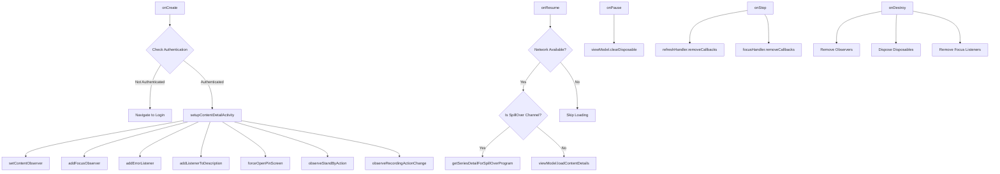
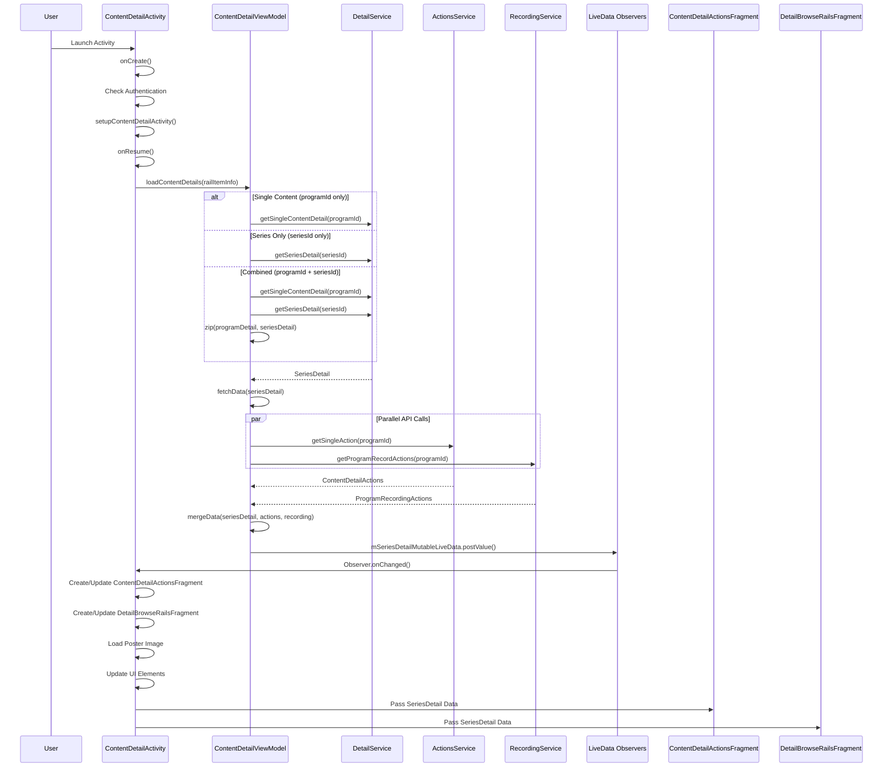
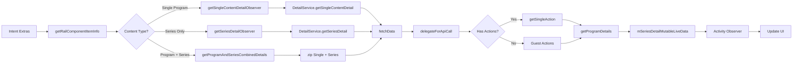
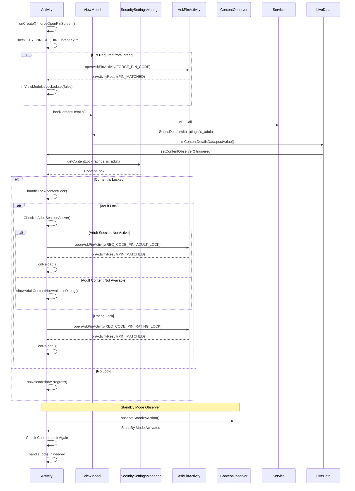
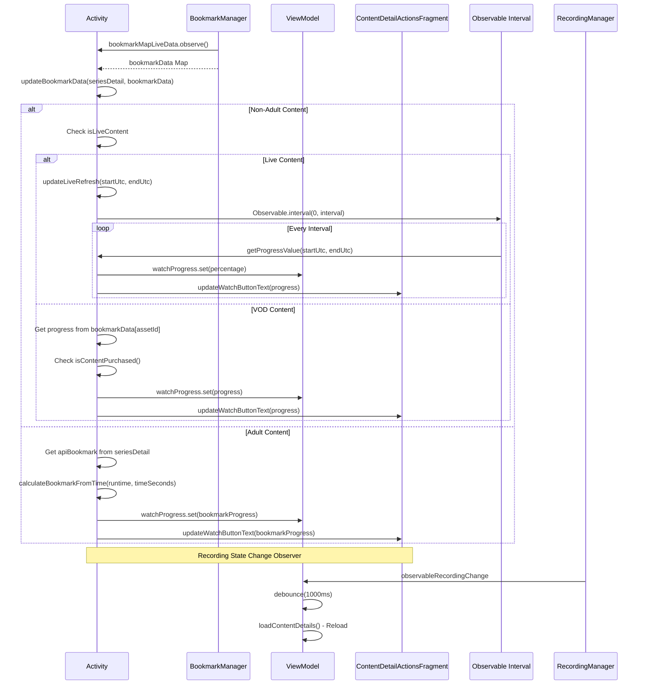
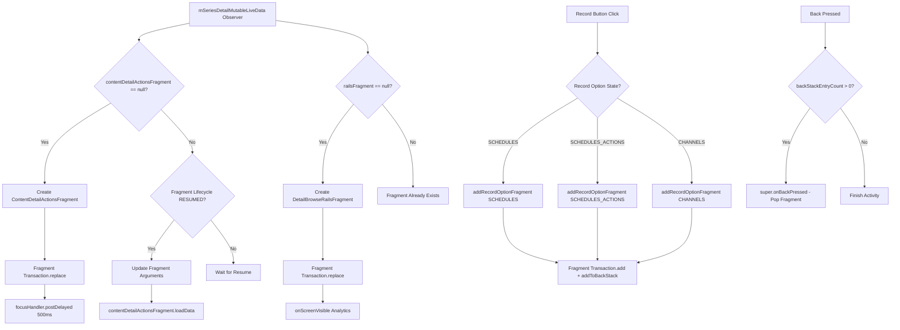
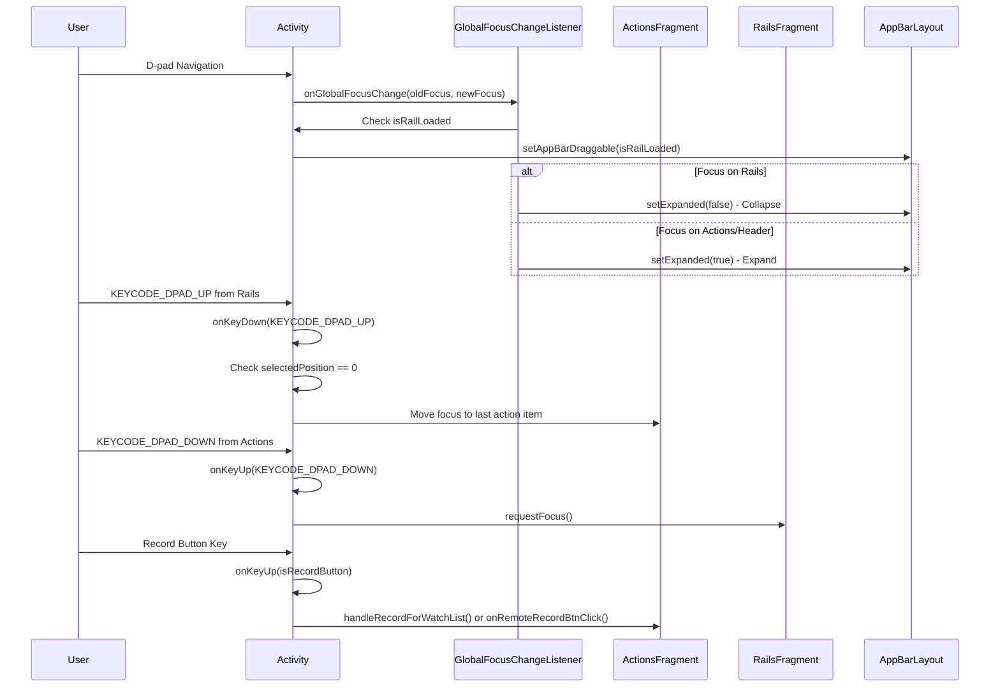
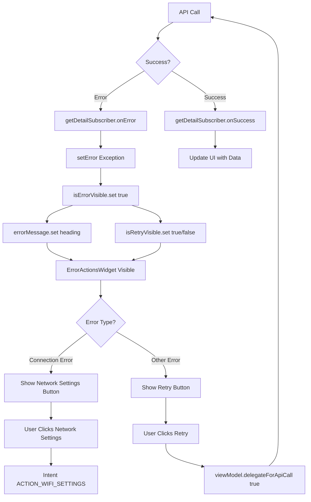
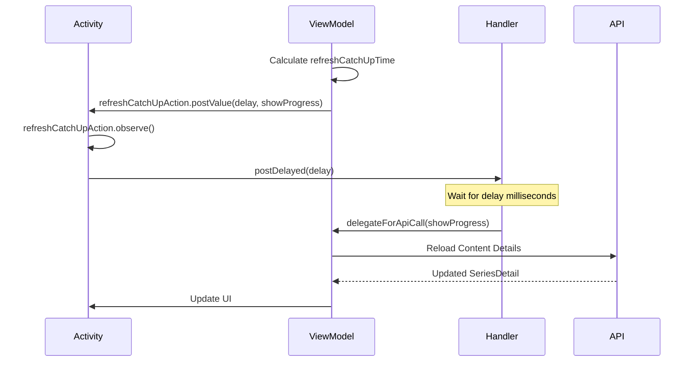

# ContentDetailActivity - Feature Analysis & Performance Review

## Overview

`ContentDetailActivity` is a complex Android TV activity that displays detailed information about TV content (series, programs, episodes). It handles content metadata, actions (watch, record, rent), security (PIN/adult content locks), bookmarks, and related content rails.

**File**: `detailui/src/main/java/com/telekom/onetv/detailui/ContentDetailActivity.kt`  
**Lines**: 1956  
**Complexity**: High - Multiple fragments, observers, handlers, and async operations

---

## Architecture Overview

```
ContentDetailActivity
├── ContentDetailViewModel (Business Logic)
├── ContentDetailActionsFragment (Action Buttons)
├── DetailBrowseRailsFragment (Related Content Rails)
├── RecordOptionsFragment (Recording Options)
└── DescriptionDetailFragment (Full Description Dialog)
```

---

## 1. Activity Lifecycle Flow



---

## 2. Content Loading Sequence Diagram



---

## 3. Data Flow - Content Details Loading



---

## 4. Security & PIN Flow



---

## 5. Bookmark & Progress Tracking Flow



---

## 6. Fragment Management Flow



---

## 7. Focus Management & TV Navigation



---

## 8. Error Handling & Retry Flow



---

## 9. Refresh & Catch-Up Action Flow



---

## Performance Pain Points Analysis

### 🔴 Critical Issues

#### 1. **Multiple LiveData Observers Without Proper Cleanup**
**Location**: Lines 253-312, 378-409, 588-729  
**Issue**: 
- Multiple `observe()` calls that may not be properly cleaned up
- Observers added in `onCreate()` but removed only in `onDestroy()`
- If activity is recreated, old observers may persist

**Impact**: Memory leaks, duplicate API calls, UI inconsistencies

**Code Reference**:
```253:265:detailui/src/main/java/com/telekom/onetv/detailui/ContentDetailActivity.kt
viewModel.refreshCatchUpAction.observe(
    this
) {
    if (it.first > 0) {
        if (!isFinishing) {
            refreshHandler.postDelayed({
                if (!isFinishing) {
                    viewModel.delegateForApiCall(it.second)
                }
            }, it.first)
        }
    }
}
```

---

#### 2. **Handler Memory Leaks**
**Location**: Lines 187-189, 258-262, 514-515, 1184-1185  
**Issue**:
- `refreshHandler` and `focusHandler` hold references to Activity
- Handlers not cleared in `onPause()` or `onStop()`
- Delayed callbacks may execute after activity is destroyed

**Impact**: Memory leaks, crashes when accessing destroyed views

**Code Reference**:
```187:189:detailui/src/main/java/com/telekom/onetv/detailui/ContentDetailActivity.kt
private val refreshHandler = Handler()

private val focusHandler by lazy { Handler(Looper.getMainLooper()) }
```

---

#### 3. **Synchronous Operations on Main Thread**
**Location**: Lines 241-251, 559-574  
**Issue**:
- `Single.fromCallable` with router/auth checks on main thread
- `getSeriesDetailForSpillOverProgram` does heavy work on main thread
- Image processing in `imageMaskHelper.loadMaskedImage` may block UI

**Impact**: ANR (Application Not Responding), UI freezes

**Code Reference**:
```241:251:detailui/src/main/java/com/telekom/onetv/detailui/ContentDetailActivity.kt
Single.fromCallable {
    router.get()
    authService.isAuthenticated || iGuestModeConfigProvider.guest.isGuestModeEnabled
}.compose(applySchedulersOnSingle()).subscribe { success ->
    if (success) {
        setupContentDetailActivity()
        setContentObserver()
    } else {
        startActivityForResult(router.get().toLoginActivity(iEnvironment), REQ_CODE_LOGIN)
    }
}.addTo(compositeDisposable)
```

---

#### 4. **Excessive Fragment Transactions**
**Location**: Lines 603-642, 672-685, 1373-1386  
**Issue**:
- Fragment transactions in LiveData observers (executed on every data change)
- Multiple fragment replacements without checking if already added
- No fragment state preservation

**Impact**: UI flickering, performance degradation, state loss

**Code Reference**:
```603:642:detailui/src/main/java/com/telekom/onetv/detailui/ContentDetailActivity.kt
if (contentDetailActionsFragment == null) {
    contentDetailActionsFragment =
        ContentDetailActionsFragment.getInstance(...)
    supportFragmentManager
        .beginTransaction()
        .replace(
            R.id.actions_container,
            contentDetailActionsFragment!!,
            ContentDetailActionsFragment.TAG
        )
        .commit()
    focusHandler.postDelayed({
        focusChanged = false
    }, 500)
} else if (contentDetailActionsFragment?.lifecycle?.currentState?.isAtLeast(
        Lifecycle.State.RESUMED
    ) == true
) {
    contentDetailActionsFragment?.arguments = ...
    contentDetailActionsFragment?.loadData()
}
```

---

#### 5. **Live Refresh Observable Not Properly Disposed**
**Location**: Lines 959-981, 1177-1179  
**Issue**:
- `liveRefreshDisposable` created multiple times without checking if already initialized
- Observable interval runs continuously even when not needed
- Not disposed in `onPause()` or `onStop()`

**Impact**: Battery drain, unnecessary CPU usage, memory leaks

**Code Reference**:
```959:981:detailui/src/main/java/com/telekom/onetv/detailui/ContentDetailActivity.kt
private fun updateLiveRefresh(
    startUtc: String?,
    endUtc: String?,
    caller: String
) {
    if (::liveRefreshDisposable.isInitialized) {
        liveRefreshDisposable.dispose()
    }
    liveRefreshDisposable =
        Observable
            .interval(0, viewModel.getInterval(), TimeUnit.MILLISECONDS)
            .map {
                val percentageWatched = getProgressValue(startUtc, endUtc)
                return@map percentageWatched
            }
            .subscribeOn(Schedulers.computation())
            .observeOn(AndroidSchedulers.mainThread())
            .subscribe {
                viewModel.watchProgress.set(it)
            }
            .also { viewModel.compositeDisposable.add(it) }
}
```

---

#### 6. **Heavy Operations in UI Thread**
**Location**: Lines 700-726, 1307-1333  
**Issue**:
- Image loading with color extraction on main thread
- Focus observer doing complex calculations on every focus change
- AppBar behavior changes on every focus change

**Impact**: UI jank, dropped frames, poor user experience

**Code Reference**:
```700:726:detailui/src/main/java/com/telekom/onetv/detailui/ContentDetailActivity.kt
it.poster_image_url?.let {
    imageMaskHelper.loadMaskedImage(
        it,
        WeakReference(this@ContentDetailActivity),
        skipCaching = false,
        dataBinding.poster,
        true
    ) { imageResponse ->
        when (imageResponse) {
            is ImageResponse.Failure -> {
                Timber.tag("ContentMetaData")
                    .d("setupContentDetailActivity: image processing error${imageResponse.error}")
                dataBinding.poster.setImageBitmap(null)
            }

            is ImageResponse.Success -> {
                if (isHomeBackgroundColorPickerEnabled) {
                    Timber.tag("DebugLog")
                        .d("ContentMetaData setupContentDetailActivity color changed enabled")
                    dataBinding.parentLayout.setBackgroundColor(
                        imageResponse.dominantColor
                    )
                }
            }
        }
    }
}
```

---

### 🟡 Medium Priority Issues

#### 7. **Multiple API Calls on Resume**
**Location**: Lines 518-537  
**Issue**:
- `onResume()` calls `loadContentDetails()` every time
- No check if data is already loaded and valid
- May cause unnecessary network calls

**Impact**: Increased network usage, slower resume time

---

#### 8. **Complex Bookmark Update Logic**
**Location**: Lines 777-845  
**Issue**:
- `updateBookmarkData()` has multiple nested conditions
- Called from multiple observers
- No debouncing for rapid updates

**Impact**: Multiple UI updates, potential race conditions

---

#### 9. **Focus Handler Delays**
**Location**: Lines 623-625  
**Issue**:
- `focusHandler.postDelayed(500ms)` hardcoded delay
- No cancellation if fragment is destroyed before delay completes

**Impact**: Potential crashes, focus issues

---

#### 10. **Recording Observer Debounce Too Short**
**Location**: Lines 336-339  
**Issue**:
- Recording changes debounced to 1000ms
- May cause multiple reloads if recording state changes rapidly

**Impact**: Unnecessary API calls, UI flickering

---

## Recommendations

### Immediate Actions

1. **Fix Handler Leaks**
   - Use `Handler(Looper.getMainLooper())` with WeakReference
   - Clear all callbacks in `onPause()` and `onStop()`

2. **Proper Observer Cleanup**
   - Remove observers in `onPause()` or use `viewLifecycleOwner` for fragments
   - Use `observeForever()` only when necessary with manual removal

3. **Fragment Transaction Optimization**
   - Check fragment state before transactions
   - Use `commitAllowingStateLoss()` only when necessary
   - Preserve fragment state on configuration changes

4. **Dispose Observables Properly**
   - Dispose `liveRefreshDisposable` in `onPause()`
   - Check if activity is finishing before updating UI

5. **Move Heavy Operations Off Main Thread**
   - Image processing should be async
   - Focus calculations should be lightweight
   - Use coroutines for async operations

### Long-term Improvements

1. **Implement ViewModel State Management**
   - Use sealed classes for UI state
   - Reduce number of LiveData objects
   - Implement proper state restoration

2. **Add Caching Layer**
   - Cache content details to avoid redundant API calls
   - Implement smart refresh logic

3. **Optimize Fragment Lifecycle**
   - Use `setMaxLifecycle()` for better control
   - Implement fragment state machines

4. **Performance Monitoring**
   - Add performance metrics
   - Track API call frequency
   - Monitor memory usage

---

## Key Metrics to Monitor

1. **Memory Usage**: Check for leaks in LeakCanary
2. **API Call Frequency**: Monitor network requests
3. **UI Frame Drops**: Use Systrace/Perfetto
4. **Activity Creation Time**: Measure onCreate to onResume
5. **Fragment Transaction Time**: Profile fragment operations

---

## Related Files

- `ContentDetailViewModel.kt` - Business logic and data management
- `ContentDetailActionsFragment.kt` - Action buttons fragment
- `DetailBrowseRailsFragment.kt` - Related content rails
- `RecordOptionsFragment.kt` - Recording options
- `ContentDetailRouter.kt` - Navigation routing

---

## Conclusion

`ContentDetailActivity` is a feature-rich but complex activity with several performance bottlenecks. The main issues stem from:

1. **Memory Management**: Handlers and observers not properly cleaned up
2. **Threading**: Heavy operations on main thread
3. **Fragment Management**: Excessive transactions and state issues
4. **Resource Usage**: Continuous observables and unnecessary API calls

Addressing these issues will significantly improve performance, reduce memory usage, and provide a smoother user experience on Android TV devices.

