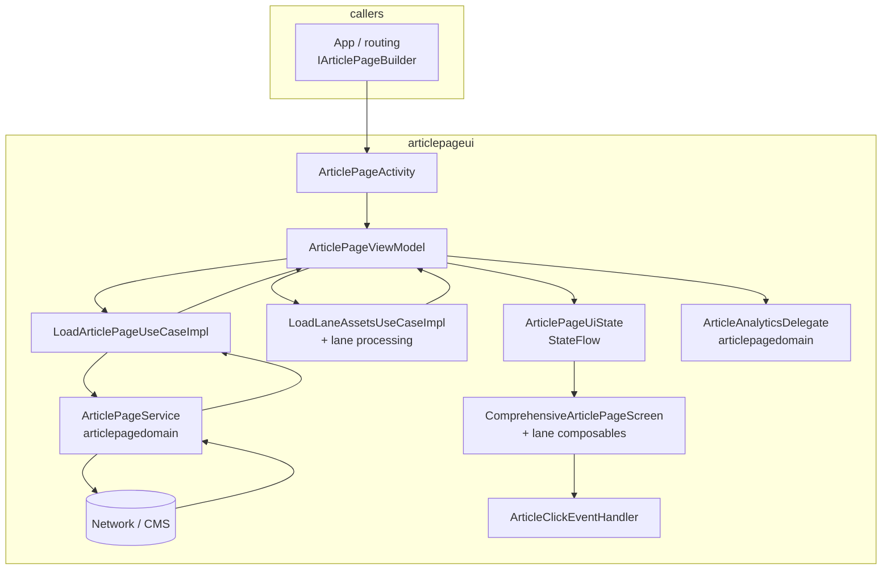

# 📦 Article page (TV UI)

**Module:** `:articlepageui` (`articlepageui/`) · **Type:** ui · **Package:** `com.telekom.atvretail.articlepageui`

---

## 👤 Ownership

- **Code owner(s):** Anurag Kumar Kachhala
- **Last reviewed:** 2026-03-27

---

## 🎯 Overview — purpose and responsibilities

- **Purpose:** Full-screen **article / editorial** experience on Android TV: CMS-driven **lanes** (rich text, hero and content images, people, buttons, backgrounds, titles), plus **loading, empty, and error** states, **D-pad / TV navigation**, and **accessibility** (including TalkBack-related handling when entering the screen).
- **Boundaries:** **`:articlepagedomain`** owns remote models, **`ArticlePageService`**, and analytics delegate types; **`:articlepageui`** owns **presentation**, **lane composition**, **TV focus**, **UI-layer use case implementations** (`LoadArticlePageUseCaseImpl`, `LoadLaneAssetsUseCaseImpl`) that call domain services, and **click / CTA routing** handlers.
- **Layer:** UI (Clean Architecture + MVVM); depends inward on domain and shared modules only.

---

## ✨ Features and responsibilities

| Area | What this module handles |
|------|---------------------------|
| Editorial reading | Long-form / marketing pages, lean-back layout |
| CMS story layout | Ordered lanes: text, media, people, CTAs from CMS structure |
| Presentation | Sticky headline, hero/background, rich body lanes |
| Actions | CTA buttons via **`ArticleClickEventHandler`** |
| Context | **`is_adult`** extra for adult-category handling |
| Resilience | Loading, error, and empty UI (not a blank screen) |
| TV & a11y | D-pad focus, scrolling, TalkBack/lifecycle hooks where needed |
| Telemetry | Article load/interaction analytics via domain delegate |
| Bookmarks | **`BookmarkManager`** integration where product requires it on this screen |

---

## 🏗 Architecture and data flow

**Patterns:** MVVM + **unidirectional state** — Compose observes **`ArticlePageViewModel`** (`StateFlow` **`uiState`**, **`laneOptimizedData`**); events are **`ArticlePageIntent`** (e.g. load by id, track interaction).

**Layered flow (this module):** **UI** → **ViewModel** → **UI-layer use case impls** → **`:articlepagedomain` `ArticlePageService`** → network/CMS (domain owns API details; there is no separate “repository” type in this feature’s UI path).

**Caption:** Caller builds `Intent` → Activity passes id/adult flag → ViewModel loads page via domain service → lane assets optimized → UI renders; CTAs use click handler; analytics delegate records events.

---

## 🧩 Key components

| Component | Role |
|-----------|------|
| **`ArticlePageActivity`** | Entry `Activity`; reads extras, hosts Compose in `composeContainer`, wires `TelekomTheme`, `LocalLanguageService` |
| **`ArticlePageViewModel` / `ArticlePageViewModelFactory`** | State, intents, orchestration |
| **`ArticlePageIntent` / `ArticlePageUiState`** | Unidirectional events and UI state (`models/`) |
| **`ComprehensiveArticlePageScreen`** | Main Compose screen; lane stack |
| **`LoadArticlePageUseCaseImpl` / `LoadLaneAssetsUseCaseImpl`** | UI-layer use cases calling domain (`useCase/`) |
| **`ArticleClickEventHandler`** | CTA and navigation from article actions |
| **`ArticlePageBuilder`** | Implements **`IArticlePageBuilder`** (`articlepagedomain`); builds `Intent` for **`ArticlePageActivity`** |
| **Dagger** | `ArticlePageActivityBuilder`, `ArticlePageUiModule`, `ArticlePageUseCaseModule`, `ArticlePageHandlersModule` |

### 🔌 Key entry points

| Kind | Location |
|------|----------|
| Activity | `ui/ArticlePageActivity.kt` |
| Main screen | `screens/ComprehensiveArticlePageScreen.kt` |
| ViewModel | `viewModels/ArticlePageViewModel.kt`, `ArticlePageViewModelFactory.kt` |
| Routing | `builder/ArticlePageBuilder.kt` |
| DI | `di/ArticlePageActivityBuilder.kt`, `ArticlePageUiModule.kt`, `ArticlePageUseCaseModule.kt`, `ArticlePageHandlersModule.kt` |

---

## 📦 Public contract

- **Launch surface:** **`ArticlePageActivity`** is **`android:exported="false"`** — only in-process callers (typically **`app`**) may start it; prefer **`IArticlePageBuilder`** from **`:articlepagedomain`** so feature routing stays behind the domain interface.
- **Intent extras (contract for `Intent` built via builder or equivalent):**
  - **`article_page_id`** (`String`) — CMS article/page id; if missing, Activity uses empty string (expect empty/error UX).
  - **`is_adult`** (`String`, parsed as boolean) — optional adult context; defaults false when absent.
- **DI:** **`ArticlePageActivity`** and its graph expect **`LanguageService`**, **`BookmarkManager`**, **`ArticleClickEventHandler`**, and domain-backed use cases to be provided by the app/component that includes **`ArticlePageActivityBuilder`**.
- **Stability:** Compose BOM and Material3 versions follow **`articlepageui/build.gradle`** / platform BOM; bumps may require UI regression on TV.
- **Backward compatibility:** Changing extra keys or **`IArticlePageBuilder`** behavior is a **breaking** change for callers; coordinate with **`:articlepagedomain`** and **`app`**.

---

## 🔗 Dependencies

### ⬇️ Consumes (Gradle `implementation` — see `articlepageui/build.gradle`)

| Module / area | Purpose |
|---------------|---------|
| `:articlepagedomain` | Article API, models, `ArticlePageService`, analytics delegate |
| `:cms` | CMS-related content/config for the article experience |
| `:retailbase` | `RetailBaseActivity` and shared retail TV shell |
| `:appcommons` / `:appcommon` | Shared extensions, services, accessibility helpers |
| `:uielements` | Shared TV UI components and resources |
| `:analytics` | Product telemetry wiring |
| `:settingsdomain` | Settings-dependent behavior where needed |
| `:epgdomain` | EPG-linked CTA/navigation context |
| `:adultauthdomain` | Adult auth aligned with `is_adult` |
| `:zappingdomain` | Channel/zapping navigation from CTAs |

**Third-party / AndroidX (direct):** Compose BOM, Compose UI (tooling preview), Material3, Activity Compose, Lifecycle ViewModel Compose, Compose Runtime LiveData, Glide Compose, Coil Compose, Leanback, ConstraintLayout (versions via `libs.*` / BOM).

### ⬆️ Exposed to

| Consumer | Usage |
|----------|--------|
| `:app` | `implementation project(':articlepageui')` — contributes **`ArticlePageActivity`**, Dagger subcomponent, and **`ArticlePageBuilder`** binding for **`IArticlePageBuilder`** |

_No other Gradle modules declare `articlepageui` today; new dependents should go through **`IArticlePageBuilder`** where possible._

---

## 🔁 Usage and integration

1. **Preferred:** Inject or obtain **`IArticlePageBuilder`** (from **`:articlepagedomain`**) and call **`toArticlePage(context, extras)`** with a **`Bundle`** containing **`article_page_id`** and optionally **`is_adult`**.
2. **Direct:** Start **`ArticlePageActivity`** with the same extras only if already inside **`app`** and the contract above is preserved (not recommended for new code).
3. **Manifest:** Activity registered in this module’s manifest with **`exported="false"`**.

---

## ⚠️ Edge cases, constraints, and limitations

| Topic | Detail |
|-------|--------|
| Missing id | Empty **`article_page_id`** yields empty string; UI should surface empty/error, not assume valid CMS data |
| **`is_adult` type** | Read as **`String`** and parsed to boolean — callers must pass a string form consistent with existing app usage |
| Not exported | No direct external deep link into **`ArticlePageActivity`**; routing must pass through the app |
| Hybrid UI | View binding host + Compose content — focus/a11y split between Android View and Compose must stay coherent |
| Domain coupling | Network failures and CMS shape are ultimately governed by **`:articlepagedomain`**; this module reflects them in UI state only |

---

## Changelog

| Date | Tags | Ticket / branch | Summary |
|------|------|-----------------|--------|
| 2026-03-27 | docs | — | Module README: overview, features, architecture, public contract, deps, usage, edge cases; template omits Health, Scope, Operations, Maintenance |
| 2025-03-24 | docs | — | Owner; module deps table; JaCoCo task and report paths; product features |
